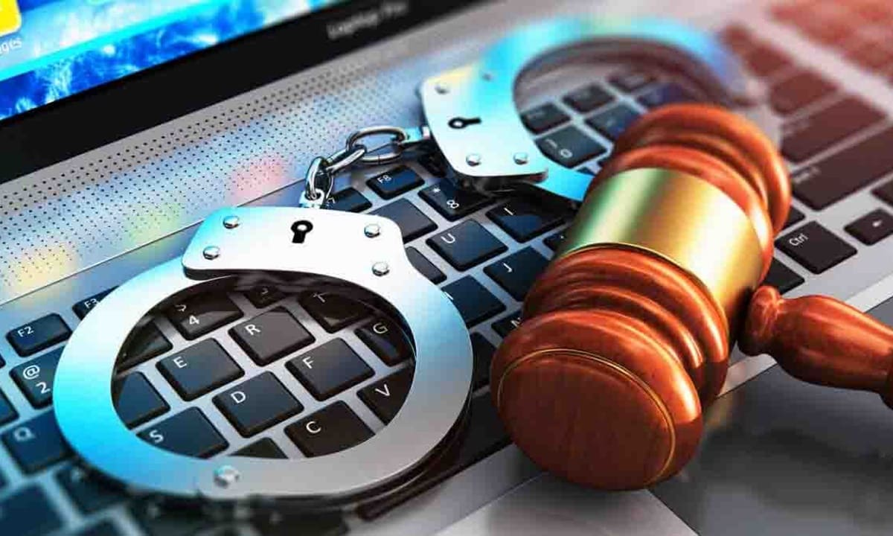
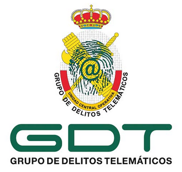
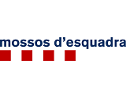
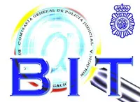
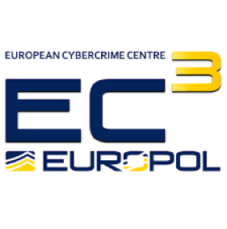

# DELICTES INFORMÀTICS

Basat en el material de Pau Tomé (IES Bosc de la Coma)

---
<!-- TOC  -->

- [Què és un delicte](#què-és-un-delicte)
- [Delictes informàtics](#delictes-informàtics)
- [Referències](#referències)

<!-- /TOC -->
---

## Què és un delicte?

Els delictes són conductes que **violen la llei penal** que al règim legal espanyol es troba en el **Codi Penal**.

Les **penes pels delictes penals** poden ser de presó i multes. Una multa és una quota de 2 a 400 euros diaris, durant el temps que s'indiqui. <https://www.iberley.es/temas/pena-multa-tipos-47201>

-**Es poden cometre diversos delictes alhora en un sol acte**... Per exemple entrant remotament en un equip aliè per obtenir informació de targetes de crèdit. Llavors s'han comés els delictes:

- Robar diners
- Accés il·legal
- Pirateria
- Descobriment de secrets

I a més hi ha una condemna diferent per cadascun.

No totes les conductes il·lícites són delictes. Hi ha altres tipus de conductes il·lícites que es diuen **infraccions administratives** i que es troben en altres lleis.

Per exemple, conduir un cotxe sense cinturó de seguretat és una infracció administrativa.

També les conductes il·lícites poden ser **infraccions civils**, tipificades en aquest cas pel **Codi Civil**. Per exemple, si algú et deu diners i no te'ls paga, és una infracció civil.

## Delictes informàtics

Anteriorment, a la legislació espanyola no existien els delictes informàtics. Es considerava simplement que eren delictes fets amb un sistema informàtic.

`“.. qualsevol acte il·lícit penal dut a terme a través de mitjans informàtics i que està íntimament lligat als bens jurídics relacionats amb les tecnologies de la informació o que té com a fi aquests bens”
`

Però a partir de la reforma del codi penal de **Març de 2015** es contemplen ja delictes informàtics com a tals.

Aquests delictes han crescut tant que les policies han creat cossos especialitzats:

- **GDT - Grupo de Delitos Telemáticos** - Guàrdia Civil
- **BCIT - Brigada Central de Investigación Tecnológica** - Policía Nacional
- **UCDI - Unitat Central de Delictes Informàtics** - Mossos d'esquadra
- **European Cybercrime Center** - EUROPOL

El Conveni sobre cibercriminalitat o [**Conveni de Budapest**](convenio-sobre-ciberdelincuencia-Budapest.pdf) (23/11/2001) va definir la base per:

- Harmonitzar les lleis dels diferents països
- Facilitar la cooperació internacional

El conveni definia grups de delictes informàtics:

1. Delictes contra la **confidencialitat, la integritat i la disponibilitat**.
2. Delictes informàtics (falsificació, frau).
3. Delictes relacionats amb el contingut (pornografia infantil).
4. Infraccions de la propietat intel·lectual.

La policia espanyola en considera algun més (del codi penal)

5. Delictes contra l’honor.
6. Amenaces i coaccions.
7. Delictes contra la salut pública.

### Delicte d'intrusió informàtica (art. 197 bis)

Aquest delicte castiga **l'accès o la facilitació de l'accès al conjunt o part d'un sistema d'informació**, vulnerant mesures de seguretat i **sense autorització**.

- Exemple: Entrar a un servidor per.

### Intercepció de transmissions de dades informàtiques (art. 197 bis ap. segon)

**Interceptar transmissions no públiques** de dades informàtiques, inclòs via senyal sense fils.

- Exemple: Usar sniffers en cable i wifi, keyloggers, troians, ...

### Revelació de secrets (art. 197 bis ap. tercer)

Revelar secrets obtinguts en els delictes anteriors.

- Exemple, publicar a Internet dades obtingudes d'accedir a un servidor web.

### Altres delictes informàtics

#### Amenaces (art. 169)

Es castiguen les amenaces realitzades o difoses per qualsevol mitjà  de comunicació.

- **Penes de presó de 6 mesos a 5 anys segons gravetat.**

#### Delictes contra l'honor: calúmnies i injúries (art. 205 i SS)

**CALÚMNIA**: Una calúmnia és acusar a algú d’haver comès un delicte sabent que és fals

**INJÚRIA**: Una injúria consisteix en lesionar la dignitat o l’honor d’una persona

### Fraus informàtics (estafa) (art. 248)

Es considera un **frau** quan amb ànim de lucre s'enganyi a algú perquè faci alguna cosa que el perjudiqui.

- El més corrent és perjudicar-lo **econòmicament**.
- Exemple: el phising bancari.

### Sabotatge informàtic (art. 264)

Es tracta de:

- Esborrar o danyar dades o programes.
- Interrompre o entorpir el funcionament d'un sistema informàtic, el que coneixem com a DoS o DDoS.
- Crear, facilitar, posseir programes o contrasenyes o codis d'accés per cometre els delictes anteriors.

### Pornografia infantil (art. 189)

Producció, venda, distribució, exhibició o possessió de material pornogràfic de menors.

### Falsedat (art. 390-SS)

Alterar alguna cosa per fer-la passar per autèntica és un delicte de falsificació

- També es castiga la possessió de software informàtic per cometre delictes de falsedat (ART 400).

### Delictes contra la Propietat Intel·lectual (art. 270 i SS)

El Codi Penal condemna especialment la còpia i distribució no autoritzada de programes d'ordinador i la possessió de mitjans per suprimir-ne les proteccions. També l’ús de sistemes informàtics per la distribució de contingut protegit per la propietat intel·lectual. 

#### Concepte còpia privada

Està permesa la realització de còpies d’obres literàries, artístiques o científiques sense prèvia autorització dels titulars de l’obra, sempre i quan la còpia no s’empri amb finalitats col·lectives, ni lucratives, ni amb ànim de perjudicar a tercers.
El dret de còpia privada **no és aplicable a programaris** (i, per tant, a videojocs tampoc) i es limita a una sola còpia.

## Referències

- Delictes informàtics al codi penal: <http://www.legaltoday.com/practica-juridica/penal/penal/los-nuevos-delitos-informaticos-tras-la-reforma-del-codigo-penal#>
- GDT Guàrdia Civil: <https://www.gdt.guardiacivil.es/webgdt/pinformar.php>
- BCIT Policia nacional:
  - <https://ca.wikipedia.org/wiki/Unitat_Central_de_Delictes_Inform%C3%A0tics>
  - <https://www.policia.es/org_central/judicial/udef/bit_quienes_somos.html>
- UCDI Mossos - <https://ca.wikipedia.org/wiki/Unitat_Central_de_Delictes_Inform%C3%A0tics>
- Investigació criminal Mossos (amb policia científica, informàtica forense)- <https://ca.wikipedia.org/wiki/Comissaria_General_d%27Investigaci%C3%B3_Criminal>
