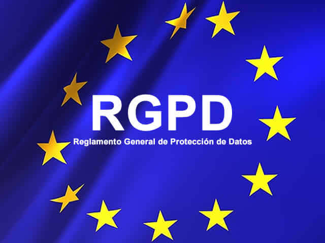
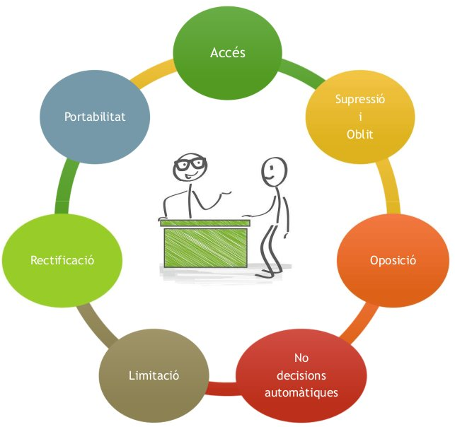
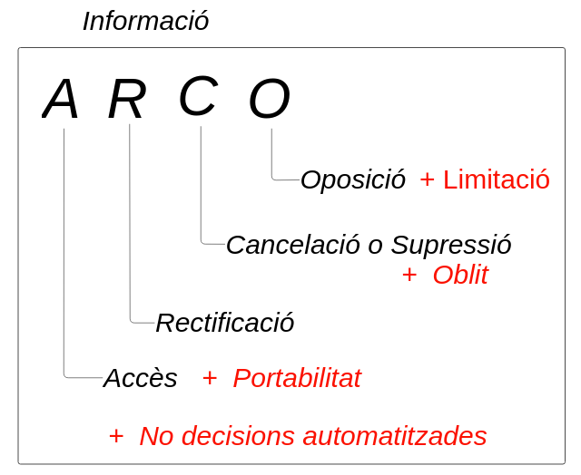
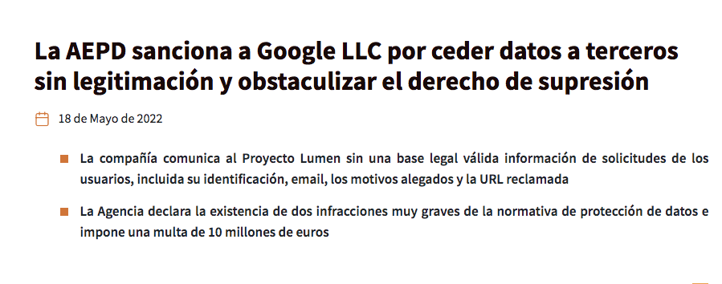
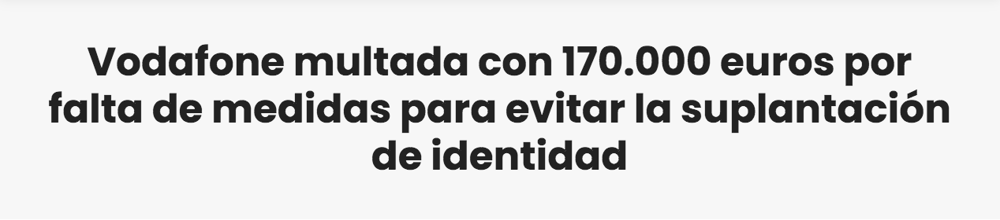

# PROTECCIÓ DE DADES PERSONALS: LOPDGDD I RGPD

Basat en el material de Pau Tomé (IES Bosc de la Coma)

---
<!-- TOC -->
- [Introducció](#introducció)
- [Motivació del RGPD i de la LOPD-GDD](#motivació-del-rgpd-i-de-la-lopd-gdd)
- [Quan van entrar en vigor?](#quan-van-entrar-en-vigor)
- [Àmbit d'aplicació (A qui/què s'aplica)](#àmbit-daplicació-a-quiquè-saplica)
- [Àmbit territorial (on s'aplica)](#àmbit-territorial-on-saplica)
- [Conceptes rellevants](#conceptes-rellevants)
  - [Fitxers](#fitxers)
  - [Tractament de dades](#tractament-de-dades)
  - [Dades personals](#dades-personals)
  - [Categories especials de dades personals](#categories-especials-de-dades-personals)
  - [El consentiment](#el-consentiment)
  - [Drets de les persones afectades](#drets-de-les-persones-afectades)
    - [Dret d'informació](#dret-dinformació)
    - [Dret d'accés](#dret-daccés)
    - [Dret a la portabilitat](#dret-a-la-portabilitat)
    - [Dret de rectificació](#dret-de-rectificació)
    - [Dret de supressió](#dret-de-supressió)
    - [Dret de l'oblit](#dret-de-loblit)
    - [Dret d'oposició](#dret-doposició)
    - [Dret a no ser objecte d'una decisió automatitzada](#dret-a-no-ser-objecte-duna-decisió-automatitzada)
    - [Dret de limitació de tractament](#dret-de-limitació-de-tractament)
- [Figures rellevants al RGPD i la LOPD-GDD](#figures-rellevants-al-rgpd-i-la-lopd-gdd)
  - [Interessat](#interessat)
  - [Responsable del tractament](#responsable-del-tractament)
  - [Encarregat del tractament](#encarregat-del-tractament)
  - [El delegat de protecció de dades (DPD)](#el-delegat-de-protecció-de-dades-dpd) 
- [Violacions de seguretat](#violacions-de-seguretat)
- [Autoritats de Protecció de Dades](#autoritats-de-protecció-de-dades)
- [Mesures de responsabilitat activa](#mesures-de-responsabilitat-activa)
- [Transferències internacionals](#transferències-internacionals)
- [Referències i materials complementaris](#referències-i-materials-complementaris)
<!-- /TOC -->
---

## Introducció

El dret a la privacitat es considera un dret fonamental. La Constitución Española de 1978, en el seu article 18.4, estableix que: "La llei limitarà l'ús de la informàtica per garantir l'honor i la intimitat personal i familiar dels ciutadans i el ple exercici dels seus drets".

Per aquest motiu, s'han desenvolupat una sèrie de lleis amb l'objectiu de garantir aquest dret. La primera llei que es va aprovar a Espanya va ser la Llei Orgànica de Protecció de Dades (LOPD) de 1999. Aquesta llei va ser substituïda per la Llei Orgànica de Protecció de Dades i de Garantia de Drets Digitals (LOPDGDD) de 2018, que és la que està vigent actualment, per adaptar-se al Reglament General de Protecció de Dades (RGPD) de la Unió Europea.

Vídeos introductoris:

- Compliment legal a l'àmbit tecnològic (LOPDGDD, LSSI i LPI). Exemple amb un hotel:
  - <https://www.incibe.es/empresas/que-te-interesa/cumplimiento-legal>
  
- INCIBE - Resum LOPD-GDD/RGPD:
  - <https://www.youtube.com/watch?v=WluUlbDVRkg&list=PLr5GsywSn9d_hd7MTimziiM8yZH1d-Igz&index=2>

Hem de tenir clar al final d'aquest bloc:

- La motivació hi ha darrera la llei.
- A qui/que/on s'aplica.
- Tipus de dades personals.
- Figures rellevants a la LOPDGDD/RGPD.
- Quines obligacions te el responsable del tractament.
- Quins drets tenen els interessats.
- Com poden exercir els drets els interessats.
- Què poden fer els interessats quan no es respecten els seus drets.

## Motivació del RGPD i de la LOPD-GDD

La normativa fonamental que regula la protecció de dades personals és:

- **RGPD** Reglament General de Protecció de Dades. Normativa desenvolupada per la Unió Europea i d'aplicació a l'Espai Econòmic Europeu (UE, Suïssa, Andorra, etc.).
- **LOPD-GDD** Llei Orgànica de Protecció de Dades i de Garantia de Drets Digitals. És la transposició al règim jurídic espanyol del RGPD. Aquesta llei substitueix l'anterior Llei Orgànica de Protecció de Dades (LOPD) de 1999.

Els objectius principals d'questes normatives són:

- **Preservar els drets i llibertats** de les persones físiques, en particular el dret a la protecció de les dades de caràcter personal.
- Les **persones físiques** han de tenir el **control de les seves pròpies dades personals**.
- Es vol aconseguir una **regulació més uniforme** a tota Europa.
- Es vol garantir la **lliure circulació de dades** entre els Estats membres.
- Es vol reforçar la **seguretat jurídica i generar la confiança** que permeti a l’economia digital desenvolupar-se en tot el mercat interior.

## Quan van entrar en vigor?

El nou Reglament General de Protecció de Dades (RGPD) va entrar en vigor el **maig de 2016** i les sancions s'apliquen des de **maig de 2018**.

- Es va establir un període d'adaptació de 2 anys per a que tothom es pogués posar en ordre.
- La llei espanyola que l'adapta e la jurisdicció espanyola és la LOPD-GDD (Llei orgànica de Protecció de Dades Personals i Garantia dels Drets Digitals) i va entrar en vigor al **desembre de 2018**.

## Àmbit d'aplicació (A qui/què s'aplica)

S'aplica sempre que:

- **Es tracta de dades de persones físiques, sense excepcions** (no importa nacionalitat o residència) pel tractament de dades personals.
- **Es fa tractament automatitzat i manual de dades personals**, recollides en un fitxer o destinades a un fitxer.
- No s’exclouen dades de contacte professionals ni d’autònoms.
- Obliga a **totes les empreses i organismes que gestionen dades personals**.

No s'aplica a:

- Dades relatives a **persones jurídiques** (empreses i organitzacions).
- **Fitxers o conjunts de fitxers que no estiguin estructurats** d’acord a criteris específics.
- **Activitat exclusivament personal o domèstica**, sense connexió amb activitat professional o comercial.

## Àmbit territorial (on s'aplica)

- Obliga a **responsables i encarregats del tractament de dades establerts a la UE**.
- També **als responsables i als encarregats del tractament no establerts a la UE**, si estan **relacionades amb l'oferta de béns o serveis a les persones que es troben a la UE**.

## Conceptes rellevants

Els conceptes que s'ha de conèixer són:

- Fitxers
- Tractament de dades
- Dades personals
- Dades de consideració especial
  - Genètiques
  - Biomètriques
  - Relatives a la salut, etc.
- Consentiment de l'interessat
- Responsable del tractament
- Encarregat del tractament
- Delegat de protecció de dades (DPD)
- Drets de l'interessat
- Violació de seguretat
- Autoritat de protecció de dades
- Anàlisi de riscos del tractament
- Registre d'activitats

### Fitxers

És qualsevol conjunt estructurat de dades personals accessibles d’acord amb criteris determinats, ja sigui centralitzat, descentralitzat o repartit de forma funcional o geogràfica.

### Tractament de dades

Qualsevol operació o conjunt d'operacions efectuades sobre dades personals o conjunts de dades personals, ja sigui per procediments automatitzats o no.

Per exemple:

- la recollida
- el registre
- l’organització
- l’estructuració
- la conservació
- l’adaptació o la modificació
- l’extracció
- la consulta
- la utilització
- la comunicació per transmissió
- la difusió o qualsevol altra forma d'habilitació d'accés
- interconnexió
- limitació
- supressió o destrucció.

### Dades personals

Una **dada personal** és qualsevol informació sobre una persona física identificada o identificable. La persona física es coneix com **l'interessat**.

O sigui, qualsevol persona la identitat de la qual es pot determinar, directament o indirectament, en particular mitjançant un identificador.

Per exemple:

- un nom
- un número d'identificació
- dades de localització
- un identificador en línia
- un o diversos elements propis de la identitat física, fisiològica, genètica, psíquica, econòmica, cultural o social d'aquesta persona.

### Categories especials de dades personals

Es consideren categories especials de dades personals les que:

- Revelin l’**origen ètnic o racial**,
- Les **opinions polítiques i les conviccions religioses** o filosòfiques,
- L’**afiliació sindical**.
- El tractament de dades **genètiques i/o dades biomètriques** dirigides a identificar de manera **unívoca** a una persona física.
- Dades relatives a la **salut**.
- Dades relatives a la **vida sexual o les orientacions sexuals** d’una persona física.

Exemple de perquè s'ha de protegir les dades personals especials:

>Abans de 1940, el cens dels habitants d'Holanda incloïa la tendència religiosa, per motius lícits ja que es volia repartir bé els diners dedicats a temples. Aquest cens va ser utilitzat pels nazis durant la segona guerra mundial per exterminar al 90% dels jueus d'Holanda.

[Font](https://books.google.es/books?id=UAC9BwAAQBAJ&pg=PT79&lpg=PT79&dq=censo+holanda+nazis&source=bl&ots=C7oGjhSgxl&sig=McS14JAD3vNpn4B8yjZLh-qpoLs&hl=es&sa=X&ved=0CEYQ6AEwBmoVChMIifrbx7SayAIVhEIUCh2Z-AZk#v=onepage&q=censo%20holanda%20nazis&f=false)

### El consentiment

L'interessat, en el moment de cedir les dades, fa **declaració inequívoca o una acció afirmativa clara**.

No és un consentiment vàlid:

- Les caselles ja marcades
- El consentiment tàcit, que és el que es dona per suposat.
- La inacció.

Ex: Continuar navegant per una pàgina web, i acceptar així que s'utilitzin galetes (cookies) per monitoritzar la seva navegació és **consentiment inequívoc**.

No és necessari el consentiment en el cas de l'**interès legítim** del responsable o d'un tercer. Per exemple, en el cas de la seguretat de les xarxes i la informació o per a la prevenció de frau.

La LOPD-GDD afegeix una sèrie de casos en els quals no és necessari el consentiment de l'interessat:

- El tractament de dades de contacte de persones físiques que presten servei a persones jurídiques, sempre amb fins de localització professional o per assumptes de caràcter professional.
- El tractament de dades d'empresaris individuals o de professionals liberals, sempre que el tractament tingui relació amb la seva activitat i no com a persona física.
- El tractament de dades d'empresaris individuals o de professionals liberals, sempre que el tractament tingui relació amb la seva activitat i no com a persona física.
- El tractament de dades relacionat amb operacions de reestructuració societària o transmissions de negoci.
- El tractament amb fins de videovigilància.
- Serà lícit el tractament de dades personals que tingui per objecte evitar l'enviament de comunicacions comercials a qui hagi manifestat la seva negativa o oposició a rebre-les.

#### Quan cal consentiment explicit?

L'interessat, en el moment de cedir les dades, indica que accepta el tractament marcant una casella "SI".

- Tractament de categories especials de dades
- Adopció de decisions automatitzades
- Transferències internacionals

Per a que sigui **explícit** s'ha de picar un SI.

#### Consentiment dels menors d'edat

A la RGPD només és vàlid si tenen **16 anys** o més. **Els estats membres de la UE poden rebaixar l'edat fins als 13 anys**.

- A Espanya la LOPD-GDD el rebaixa als **14 anys** (Article 7).
- A més, el llenguatge utilitzat per informar als menors ha de ser comprensible per ells.

### Drets de les persones afectades

Els drets dels interessats reconeguts pel RGPD i LOPD-GDD són els que podem veure a la imatge següent. Es fa servir el mnemotècnic ARCO (Accès, Rectificació, Cancelació i Oposició) per recordar els principals drets que reconeixia la LOPD de 1999. Els nous drets apareixen en vermell (Limitació, Oblit, Portabilitat, No decisions automatitzades).

#### Dret d'informació

Dret de les persones afectades a ser informades en els aspectes següents:

- La **base jurídica del tractament**.
- Els **interessos legítims perseguits** en què es fonamenta el tractament.
- Les **dades de contacte del DPD**, delegat de protecció de dades.
- La **intenció de transferir les dades a un tercer país** o a una organització internacional i la base per fer-ho.
- El **termini durant el qual es conservaran** les dades.
- El dret a sol·licitar la **portabilitat**
- El dret a **retirar en qualsevol moment el consentiment** que s'hagi prestat.
- Si la **comunicació de dades és un requisit legal o contractual o un requisit necessari per subscriure un contracte**.
- El dret a **presentar una reclamació davant una autoritat de control**.
- L'**existència de decisions automatitzades**, inclosa la lògica aplicada i les seves conseqüències.

#### Dret d'accés

- L’interessat pot **obtenir confirmació de si s’estan tractant** les seves dades.
- Pot tenir **accés a les seves dades** i a la informació del tractament.
- Dret a **obtenir una còpia de les dades personals** objecte del tractament, incloent documents.

#### Dret a la portabilitat

El dret a la portabilitat de les dades és una **forma avançada del dret d'accés**.

- La persona interessada té **dret a rebre les dades personals que l’afecten** en un format estructurat, d'ús comú i de lectura mecànica.
- Inclou el **dret que les dades es transmetin directament de responsable a responsable**, si és tècnicament possible.

#### Dret de rectificació

- Dret a obtenir la **rectificació de les dades personals inexactes** que li concerneixen.
- Pot donar **dret a la limitació/bloqueig de les dades** mentre es verifica l’exactitud de les mateixes o existeix un procés de reclamació.
- S’haurà de **comunicar la rectificació a tots els possibles destinataris**.

#### Dret de supressió

Dret a la **supressió de les dades personals** que li concerneixin.

Aquest dret però té les següents excepcions:

- Existència d'un procés de reclamació
- Concorren altres finalitats legítimes (p. ex. Fiscals)

S’haurà de **comunicar l’eliminació a tots els possibles destinataris**.

#### Dret de l'oblit

El dret de supressió dona peu al **Dret a l’Oblit**

- És la conseqüència de la aplicació del dret de supressió de les dades personals **en l’entorn on-line**.
- Quan les dades personals s’hagin fet públiques, **el responsable haurà d’informar a altres responsables de la sol·licitud de l’interessat d’esborrar** la seva informació personal.
- S’**inclou qualsevol enllaç a aquestes dades personals**, o **qualsevol còpia** o rèplica de les mateixes.

Exemple: [El cas Google i el dret a l'oblit] (<https://www.elabogadodigital.com/el-derecho-al-olvido-y-google>)

#### Dret d'oposició

Dret a **oposar-se al tractament de les seves dades**.

Excepcions:

- Les dades són d'**Interès públic**.
- Hi ha un **interès legítim del responsable**.
- El tractament es fa amb una **finalitat d’investigació científica o històrica, o finalitats estadístiques**.
- **No necessàriament implica l’esborrat de les dades**.

#### Dret a no ser objecte d'una decisió automatitzada

**Dret a no ser objecte d’una decisió basada únicament en el tractament automatitzat**, inclosa l’elaboració de perfils.

- En especial si li produeix efectes jurídics o li afecta significativament de manera similar.
- L’interessat té el **dret a obtenir intervenció humana per part del responsable**, a expressar el seu punt de vista i a impugnar la decisió.

**Permès si**:

- Es necessari per celebrar un contracte.
- Està autoritzada pel dret de la UE.
- Hi ha un consentiment explícit de l’interessat.

#### Dret de limitació de tractament

A petició de l’interessat, **no s’aplicaran a les seves dades personals les operacions de tractament** que en cada cas correspondrien Es pot sol·licitar la limitació quan:

- L’interessat ha exercit els drets de rectificació o oposició i el responsable està en **procés de determinar si procedeix atendre a la sol·licitud**.
- El **tractament és il·lícit**, la qual cosa determinaria l’esborrat de les dades, però l’interessat s’oposa a això.
- Les **dades ja no són necessàries** per al tractament, que també determinaria el seu esborrat, però l’interessat sol·licita la limitació perquè els necessita per a la formulació, l’exercici o la defensa de reclamacions.

L'incompliment per part dels responsables del tractament de les dades es considera una infracció.

[Link notícia](https://www.aepd.es/prensa-y-comunicacion/notas-de-prensa/la-aepd-sanciona-google-llc-por-ceder-datos-terceros-sin)

### Figures rellevants al RGPD i la LOPD-GDD

Les següents figures són importants al RGPD i cal conèixer-les.

[Glossari](https://apdcat.gencat.cat/ca/documentacio/preguntes-frequents/glossari/)

#### Interessat

La persona física identificada o identificable de la qual volem recollir i gestionar les seves dades personals.  

#### Responsable del tractament

La persona física o jurídica, autoritat pública, servei o qualsevol altre organisme que, sol o juntament amb d’altres, **determina  les finalitats i els mitjans del tractament**. Per exemple, Telefònica o Jazztel tracta dades per a poder donar un servei de telecomunicacions.

#### Encarregat del tractament

La persona física o jurídica, autoritat pública, servei o qualsevol altre organisme que **tracta dades personals per compte del responsable del tractament**. Podria ser el mateix Responsable. Per exemple, empreses que fan les contractacions, serveis d'avaries, etc. com a empreses externes amb contracte amb Telefònica o Jazztel.

#### El delegat de protecció de dades (DPD)

El RGPD/LOPD-GDD estableix la figura del **Delegat de protecció de dades (DPD)**, que serà obligatòria:

- En **Autoritats i organismes públics**, per exemple, el Departament d'Educació.
- Quan es realitzin **operacions** de tractament que requereixin **una observació habitual i sistemàtica d’interessats a gran escala**.
- Quan es realitzin el **tractament a gran escala de dades sensibles**.

##### Funcions del DPD

En general, participar en totes las **qüestions relatives a la protecció de dades**.

- Actuar com a **punt de contacte per als interessats** en tot el que tingui relació amb el tractament de les seves dades personals i exercici dels seus drets.
- Realitzar la gestió prèvia de les reclamacions.
- **Informar al responsable, encarregat i empleats de les obligacions** i disposicions obligatòries.
- **Supervisar el compliment del RGPD**, incloent l**’assignació de responsabilitats, la conscienciació i formació del personal, i les auditories** corresponents.
- **Assessorar amb respecte l’AIPD (Avaluació d'Impacte relativa a la Protecció de Dades)** i supervisar la seva aplicació.
- **Cooperar amb les autoritats de control**, actuant com a punt de contacte en qüestiones relatives als tractaments, inclosa la consulta prèvia.

Per exemple, a Educació per obligació s'ha de tenir un DPD: [Enllaç de Departament Educació](https://educacio.gencat.cat/ca/departament/proteccio-dades/dpd)

### Violacions de seguretat

Veure vídeo: [(2021) "¿Cómo identificar una fuga de información?" Monitoriza y analiza el tráfico - Cas de fuga de dades a un hospital](https://www.youtube.com/watch?v=2yH3OzklUAU&list=PLr5GsywSn9d_hd7MTimziiM8yZH1d-Igz)

**Violació de seguretat:** És tot incident que afecti a dades personals. I que pugui comportar:

- Destrucció
- Pèrdua
- Alteració accidental o il·lícita
- Comunicació o accés no autoritzats a aquestes dades.

El responsable del tractament ha de **notificar-la a la AGPD (Agència de protecció de dades)**, tret que sigui improbable que la violació suposi un risc pels drets i llibertats dels afectats.

- Dins de les **72 hores següents** al fet de que es tingui constància d’ella (s'ha comprovat).
- Cal **documentar totes les violacions** de seguretat.
- Si comporta un **alt risc pels drets o llibertats dels interessats**, la notificació a l’autoritat de supervisió haurà de complementar-se amb una **notificació dirigida als interessats**.

**L’incompliment del deure de notificació es considera infracció greu (10 M€ o 2% de facturació, la que sigui més gran).**

### Autoritats de Protecció de Dades

Qualsevol ciutadà de la UE té **dret a presentar reclamacions** de manera individual o col·lectiva si considera que el tractament de les seves dades personals vulnera el RGPD.

- També, atès la privacitat és un dret fonamental, tindrà **dret a la tutela judicial efectiva**.
- A més, tindrà dret a la **indemnització pels danys i perjudicis** soferts a conseqüència d'una infracció del RGPD.

Les **autoritats podran investigar i corregir les infraccions**. Per això, estaran en disposició d'ordenar al responsable o a l'encarregat que faciliti informació, dugui a terme auditories o obtingui accés a les dades, locals i equips.

Aquestes autoritats són **Organismes públics** que vetllen per garantir el dret a la protecció de dades personals. Les seves funcions són:

- Informem sobre els **drets** en aquesta matèria
- Informen com s'**exerceixen els drets**
- Informen de què cal fer si no es respecten els drets.
- Assessoren sobre les **obligacions que preveu la legislació**
- Controlen que les entitats les compleixin adequadament fent inspeccions o atenent denuncies.
- **Sancionar els organismes que no compleixin** les obligacions assignades.

Les sancions per infracció podran anar, des d'advertiments si la infracció és possible, prevencions i limitacions temporals, fins a prohibir el tractament, ordenar supressió de dades i imposar multes.

#### Autoritats de protecció de dades a Espanya

- [Agència Espanyola de Protecció de dades](https://www.aepd.es/)
- [Autoritat catalana de protecció de dades](http://apdcat.gencat.cat/ca/documentacio/RGPD/novetats/)
- [Datuak Babesteko Euskal Bulegoa](http://www.avpd.euskadi.eus/informazioa/datuak-babesteko-erregelamendu-orokorrak/s04-5273/eu/)
- [Consejo de Transparencia y Protección de Datos de Andalucía](https://www.ctpdandalucia.es/area-de-proteccion-de-datos)

### Mesures de responsabilitat activa

El RGPD estableix les mesures que els responsables i/o encarregats, han d’aplicar per **garantir que els tractaments són conformes al Reglament i estar en condicions de demostrar-ho**. El fet de poder demostrar-ho es coneix com "**accountability**”, que és la capacitat de retre comptes.

Les mesures a tenir en compte són:

1. **Registre d’activitats de tractament** (si l'empresa té més de 250 empleats):

Cal mantenir un **registre d’operacions de tractament** en el que es contingui la informació que estableix el RGPD.

2. **Anàlisi de Riscos** inherents dels tractaments:

Els responsables hauran de realitzar una **valoració del risc dels tractaments que realitzin**, per posar mesures a aplicar i com fer-ho.

3. **Mesures tècniques i organitzatives de seguretat** adequades al risc:

- Comprèn totes les **mesures tècniques i organitzatives per**:
  - **Garantir un nivell de seguretat adequat** en funció dels riscos detectats en l’anàlisi previ.
  - **Minimitzar els riscos identificats** en l’Avaluació d’Impacte.
- Exemples:
  - Evitar accés a persones no autoritzades: bloquejos, contrasenyes, etc.
  - Emmagatzematge de dades en paper i medis electrònics de forma segura.
  - Destrucció segura de dades.
  - No comunicar dades personals per telèfon.
  - Identificació i autenticació dels usuaris.
  - Limitar accés usuaris a la informació.
  - Ús de contrasenyes per accedir a la informació:
    - Políticas de contrasenyes.
    - No compartir contrasenyes.

4. **Protecció de dades des del disseny i per defecte**:
Pensar en termes de protecció de dades des del mateix moment en què es dissenya un tractament.

5. **Notificació de violacions de seguretat** de les dades:

- Dins de les **72 hores següents** al fet.
- **Documentar totes les violacions**.
- Si comporta un **alt risc pels drets o llibertats dels interessats**, també cal **notificació dirigida als interessats**.

6. **Avaluació d’impacte sobre la protecció de dades** (sobre drets i llibertats dels interessats)

No implantar mesures adequades al risc es considera infracció greu (10 M€ o 2% de facturació, la més alta de les dues)

[Link notícia](https://www.adaptacion-rgpd.eu/vodafone-multada-con-170-000-euros-por-falta-de-medidas-para-evitar-la-suplantacion-de-identidad/)

### Transferències internacionals

Les dades **només podran ser comunicades fora de l’Espai Econòmic Europeu**:

- A territoris que ofereixen un **nivell de protecció adequat**.
- Quan s’hagin ofert **garanties adequades sobre la protecció que les dades rebran** en la seva destinació.
- Quan s’apliqui **alguna de les excepcions que permeten transferir les dades**.

- **Privacy Shield** va ser un acord entre la UE i els EUA per la transferència de dades, però va ser invalidat pel Tribunal de Justícia de la UE el 16 de juliol de 2020.
- **Privacy Shield 3.0**: és un nou intent d'acord sobre privacitat entre la UE i EE.UU. per permetre la transferència de dades [Link](https://marketing4ecommerce.net/la-ue-y-ee-uu-establecen-un-nuevo-acuerdo-para-permitir-el-traspaso-de-datos-entre-ambas-potencias/)

## Referències i materials complementaris

### RGPD i LOPD

- [RGPD para pymes](https://www.incibe.es/protege-tu-empresa/rgpd-para-pymes)
- [Vídeo RGPD Derecho-Ficción](https://www.youtube.com/watch?v=jRaAXWQUdPg)
- [Vídeo LOPD i Partits polítics](https://www.youtube.com/watch?v=E2Tj4wXX3YY)
- [Vídeo privacitat digital de menors](https://www.youtube.com/watch?v=i09dlN7SKuA)
- [Vídeo ¿Por qué me vigilan, si no soy nadie? | Marta Peirano | TEDxMadrid](https://www.youtube.com/watch?v=NPE7i8wuupk)
- [Entrevista Buenafuente-Marta Peirano llibre "el enemigo conoce el sistema" (feb2020)](https://www.youtube.com/watch?v=fdRLSVAZWAw)
- [La vigilancia es un problema colectivo, como el cambio climático | Marta Peirano (19-11-2019)](https://www.youtube.com/watch?v=7wPFYdazgUs)
- [Article "Ús malintencionat de les dades personals" Pablo Yglesias](https://www.pabloyglesias.com/privacidad-uso-malintencionado/)
- [Tallers de seguretat de Criptica](https://gitlab.com/dhole/criptica_presentacions/-/blob/master/2018-09-12_Tor_Como_Funciona/markdown.md)
- [Compliment legal (INCIBE 2023](https://www.incibe.es/empresas/que-te-interesa/cumplimiento-legal)
- [RGPD per a PIMES (INCIBE 2023)](https://www.incibe.es/empresas/te-ayudamos/rgpd-para-pymes)

### Legislació

- [RGPD a la web de la unió europea](https://ec.europa.eu/info/law/law-topic/data-protection_es)
- [RGPD en català](http://apdcat.gencat.cat/ca/documentacio/RGPD/textos_normatius/)
- [LOPD-GDD](https://www.boe.es/buscar/doc.php?id=BOE-A-2018-16673)
- [Guies per aplicar RGPD](https://www.aepd.es/guias/index.html)
- [Guia per a centres educatius](http://www.tudecideseninternet.es/agpd1/images/guias/GuiaCentros/GuiaCentrosEducativos.pdf)
- [Protecció de dades a centres educatius públics](http://ensenyament.gencat.cat/ca/departament/proteccio-dades/)
- [Explicació pràctica per a PYMES del compliment legal](https://www.youtube.com/watch?v=h8IAVQTmMJs)

### Privacitat

- Documental "La Historia de Aaron Swartz - El Chico de Internet [HD](https://www.youtube.com/watch?v=yzlcV-BMK6I)
- Llibre "Nosotros" [Wikipedia](https://es.wikipedia.org/wiki/Nosotros_(novela))
- [Llibre "Resistencia digital"](https://www.criptica.org/material/resistencia_digital.pdf)
- [TED Marta Peirano: Por qué me vigilan si no soy nadie?](https://www.youtube.com/watch?v=NPE7i8wuupk)
- [El dilema de las redes sociales (Docu Netflix)](https://www.documaniatv.com/ciencia-y-tecnologia/redes-sociales-el-dilema-social-video_e125dff9a.html)
- Termes i condicions- Resum dels termes i condicions que ningú llegeix dels serveis d'Internet [tosdr.org](https://tosdr.org/)
