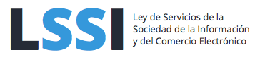
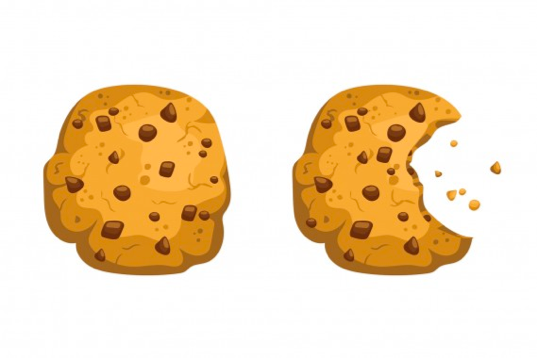
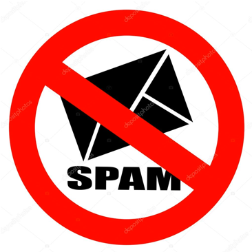

# LSSI

<!-- TOC -->
- [Introducció](#introducció)
- [Àmbit d’aplicació](#àmbit-daplicació)
- [Prestadors de serveis](#prestadors-de-serveis)
  - [Obligacions](#obligacions)
- [Cookies](#cookies)
- [Publicitat electrònica](#publicitat-electrònica)
- [Comerç electrònic i contractació en línia](#comerç-electrònic-i-contractació-en-línia)
- [Proveïdors de serveis](#proveïdors-de-serveis)
  - [Obligacions per als proveïdors de serveis](#obligacions-per-als-proveïdors-de-serveis)
- [Documentació](#documentació)
<!-- /TOC -->
---

## Introducció

Defineix un marc legal per als serveis de la Societat de la Informació i els contractes celebrats mitjançant l’ús de mitjans electrònics:

- Comerç electrònic
- Contractació en línia
- Informació i publicitat
- Serveis d’intermediació

## Àmbit d’aplicació

Quan el servei prestat es realitzi a l’estat espanyol:

- Web ubicades dins el territori de l’estat.
- Empreses que realitzin activitat o tributin a Espanya.

Quan l’activitat sigui econòmica o lucrativa pel prestador del servei. Encara que el servei sigui gratuït pel client, si genera una activitat econòmica (per exemple, ingressos per publicitat a la web).

## Prestadors de serveis

Empresa o particular que realitzi una activitat a Internet que entri dins l’àmbit de la llei.

### Obligacions pels prestadors de serveis

Posar a disposició de l’usuari les dades d’informació general:

- Nom de l'empresa
- Adreça
- NIF
- Forma de contacte(correu electrònic, telèfon o FAX)
- Dades d'inscripció registral
- Codis de conducta als que estigui adherit
- Dades de l'autorització administrativa, si escau

Si hi ha referència a preus, ha de ser clara i precisa:

- Indicant si els impostos ja estan aplicats o no.
- Despeses d’enviament.
- Forma de pagament.

## Cookies

Cookie és un arxiu que s’instal·la al client i permet emmagatzemar i recuperar informació quan es connecta amb el navegador, per exemple, recordar les preferències de navegació.

La LSSI regula el seu ús (combinat amb RGPD) i limita quina utilització es fa d’aquesta informació.

Es defineixen diversos tipus de cookies: tècniques, de personalització, d’anàlisi i publicitàries.

Les cookies s’han de notificar a l’usuari i aquest ha de donar el seu consentiment, excepte les tècniques, que són necessàries per al funcionament de la web.

L'incomplent d'aquesta normativa és motiu de sanció. Aquí alguns casos:

- [Iberia multada amb 30.000 € per incomplir política de cookies (2019)](https://www.conversia.es/iberia-multada-por-incumplir-con-la-politica-de-cookies/)
- [Freshly Cosmetics multada amb 4.000 € per preseleccionar les cookies de la seva web (2023)](https://lawwwing.com/blog/sancion-de-4000e-por-premarcar-las-cookies-de-su-pagina-web/)

Aquest 2023 s'ha aprovat una nova normativa. Un dels aspectes que s'han modificat és acceptar que l'alternativa al `mur de cookies` és el `mur de pagament`. Això vol dir que si no acceptes les cookies, no pots accedir al contingut de la web de forma gratuïta.

>Por otro lado, en cuanto a los muros de cookies, la Guía anterior ya precisaba que para que el consentimiento pudiera considerarse otorgado libremente, el acceso al servicio y a sus funcionalidades no podía estar condicionado a que el usuario consistiese el uso de cookies. Por tanto, podía haber supuestos en los que la no aceptación de la utilización de cookies impidiese el acceso al sitio web o la utilización total o parcial del servicio, siempre que se informase al usuario y se ofreciese por parte del editor una alternativa de acceso al servicio sin necesidad de aceptar el uso de cookies. La nueva versión de la Guía aclara que dicha alternativa no tendrá por qué ser necesariamente gratuita.

## Publicitat electrònica

La LSSI regula la publicitat electrònica, que és tota forma de comunicació comercial incloent qualsevol mitjà electrònic, com ara correu electrònic, SMS, MMS, xats, etc.

Obligació d’informar que es tracta d’informació publicitària. Es prohibeix l’spam (correu no desitjat). Marcar el correu com “publi” o “publicitat” i incloure un enllaç per donar-se de baixa.

## Comerç electrònic i contractació en línia

La LSSI regula el comerç electrònic, que és la venda de béns o serveis a través d’Internet.

Obligació d’informar de forma clara i inequívoca:

- Característiques del producte.
- Preu final, amb impostos i despeses d’enviament.
- Forma de pagament.
- Forma d’enviament.
- Durada de l’oferta.
- Dret de desistiment
- Idioma en què es realitzarà la contractació.

Amb posterioritat a la contractació (període màxim de 24 hores), s’ha de confirmar la compra per escrit, amb totes les dades de la mateixa.

Els contractes en línia són vinculants per a les dues parts. El client té dret de desistiment en un període de 14 dies naturals, sense necessitat de justificar la decisió i sense penalització.

## Proveïdors de serveis

Empreses que ofereixen serveis de la societat de la informació:

- Empreses que ofereixen serveis de connexió a Internet (ISP).
- Prestadors de serveis d'allotjament (hosting).
- Cercadors i proveïdors d'enllaços.

### Obligacions per als proveïdors de serveis

- Col·laborar amb els requeriments de les autoritats.
- Informar als clients dels medis tècnics per incrementar la seguretat, quins apliquen ells i les responsabilitats dels usuaris per fer un ús il·lícit del servei.

Els proveïdors de serveis **no són responsables** dels continguts que circulen per la seva xarxa, excepte que no hagin actuat amb la deguda diligència per retirar-los o bloquejar-los.

## Documentació

- [LSSI text legal](https://lssi.mineco.gob.es/Paginas/index.aspx)
- [INCIBE Cumplimiento Legal](https://www.incibe.es/empresas/que-te-interesa/cumplimiento-legal)
- [AEPD Guia ssobre el uso de cookies. Juliol 2023](https://www.aepd.es/documento/guia-cookies.pdf)
