# LLEI DE PROPIETAT INTEL·LECTUAL I LLICENCIES D'US

Imatge: <https://santiagomediano.com/propiedad-intelectual-derechos-de-los-titulares-vs-derechos-de-los-usuarios>

---

Basat en el document de Xavier Sala Pujolar

<https://docs.google.com/presentation/d/11foeWsnAj35pLofWG5FYElOxo198TNd181KfbN3MBiE/edit#slide=id.gb800a009f_1_84>

---

<!-- TOC  -->
- [Propietat intel·lectual](#propietat-intellectual)
- [Drets d'autor](#drets-dautor)
  - [Què protegeixen els drets d'autor?](#què-protegeixen-els-drets-dautor)
  - [Objectius dels drets d'autor](#objectius-dels-drets-dautor)
  - [Qui té drets d'autor?](#qui-té-drets-dautor)
  - [Registre de la propietat intel·lectual](#registre-de-la-propietat-intellectual)
- [Tipus de drets d'autor](#tipus-de-drets-dautor)
  - [Drets morals](#drets-morals)
  - [Drets d’explotació](#drets-dexplotació)
  - [Dret de còpia privada](#dret-de-còpia-privada)
    - [Cànon digital](#cànon-digital)
  - [Qui pot fer servir una obra amb drets d'autor?](#qui-pot-fer-servir-una-obra-amb-drets-dautor)
    - [Llicenciament alternatius](#llicenciament-alternatius)
      - [Creative Commons](#creative-commons)
      - [Copyleft](#copyleft)
- [Programes d'ordinador](#programes-dordinador)
  - [Freeware](#freeware)
  - [Freemium](#freemium)
  - [Programari lliure (free software)](#programari-lliure-free-software)
  - [Codi obert (open source)](#codi-obert-open-source)
  - [Domini públic](#domini-públic)
- [Referències](#referències)
- [Documentals](#documentals)
<!-- /TOC -->
---

## Propietat intel·lectual

La propietat intel·lectual fa referència a les creacions de la ment humana.

Les proteccions d'aquestes creacions prenen dues formes:

- **Drets d’autor**
- **Propietat Industrial** (Patents, marques i noms comercials o dissenys industrials)

Les patents es registren a l'[Oficina de patentes y marcas](https://www.oepm.es/es/index.html) i permeten explotar en exclusiva una invenció durant un temps determinat. A canvi, l'inventor ha de fer públic el seu invent.

La propietat industrial al protegir marques intenta evitar que els consumidors s’equivoquin (està prohibit enganyar-los) i que els competidors no puguin fer servir el nom comercial.

  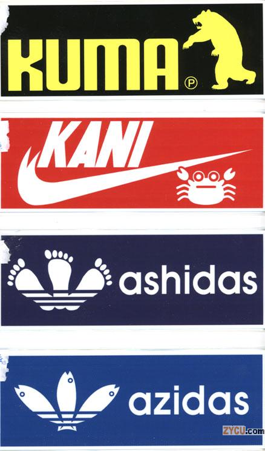

Els dissenys industrials protegeixen la forma d’un producte (no la funció). Per exemple, la forma d’una ampolla de Coca-Cola.

  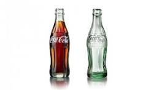

## Drets d'autor

Parlem de drets d'autor, quan parlem dels drets que té l'autor d'una obra creativa.

### Què protegeixen els drets d'autor?

Els drets d'autor protegeixen:

- **Obres escrites**: llibres, discursos, novel·les, etc.
- **Obres musicals**: música, lletres, ...
- **Obres artístiques**: dibuixos, pintures, ...
- **Multimèdia**: pel·lícules, jocs d’ordinador, TV
- **Obres dramàtiques**: teatre, dansa, ...
- **Programes d’ordinador**

### Objectius dels drets d'autor

Intenten aconseguir que un autor pugui **gaudir de la seva obra i dels seus fruits**.

- Els drets d’autor no protegeixen idees sinó la implementació que se’n fa.
- La condició per tenir drets d'autor és que l'**obra sigui original**.
- Copiar una obra, o parts importants, pretenent ser-ne l'autor és un **plagi** i és delicte.
- No importa la qualitat artística de la creació.

### Qui té drets d'autor?

Els drets d’autor s’atorguen a l’autor immediatament, al crear l'obra.

- Si hi ha diversos autors es una **obra col·lectiva**. Tots ells reben els drets d’autor.
- Les obres d’autors desconeguts també tenen drets d’autor.

La possibilitat de decidir si es divulga l'obra dura fins 70 anys des de la mort de l’autor.

Es fa servir el **símbol de copyright** per indicar que una obra està protegida.

- Però està protegida encara que no hi sigui.
- Els drets es reben al fer l'obra.

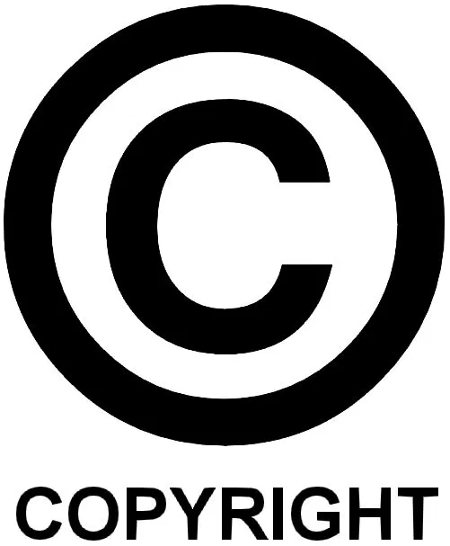

### Registre de la propietat intel·lectual

Tot i que l'autor te els drets de propietat intel·lectual en crear l'obra, ha de provar que l'ha creat ell. En cas de no haver-hi cap més prova, el registre de la propietat intel·lectual és una prova vàlida en un judici.

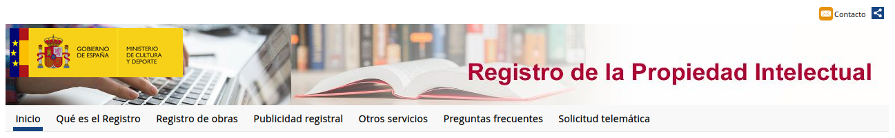

Existeixen Registres de la propietat intel·lectual (RPI) on podem registrar les nostres obres:

- [RPI Espanya](http://www.culturaydeporte.gob.es/cultura/propiedadintelectual/registro-de-la-propiedad-intelectual.html)
- [RPI Catalunya](https://cultura.gencat.cat/ca/departament/estructura_i_adreces/organismes/rpi/)

La inscripció és voluntària perquè els drets ja es tenen... Tot i que això no és garantia de ser l’autor! Pot ser que algú registri una obra que no ha fet per "robar" l'autoria.

Inscriure-hi una obra té un **cost econòmic** [taxes](https://cultura.gencat.cat/ca/departament/estructura_i_adreces/organismes/rpi/serveis/taxes/)

## Tipus de drets d'autor

Hi ha dos tipus de drets d’autor:

- **Drets morals**: Són irrenunciables.
- **Drets d’explotació**: Es poden vendre o cedir a tercers.

### Drets morals

Es composen dels següents drets:

- Dret a ser reconegut
- Dret a garantir la integritat de l’obra
- Dret a divulgar l’obra
- Dret a accedir a l’exemplar únic (si l'ha venut per exemple, té dret a accedir-hi)

Els drets morals no caduquen mai (excepte el dret a decidir si divulgar l'obra que dura fins 70 anys després de morir l'autor)

### Drets d’explotació

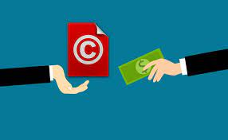

Els drets d’explotació permeten **decidir si es poden fer còpies i quina és la compensació econòmica** que rep el propietari dels drets.

El **comprador podrà fer còpies sense permís** en els casos següents:

- Per motius judicials
- Adaptació per invidents
- Còpia privada

Els drets d'explotació concedeixen la possibilitat de:

1. Reproducció de l’obra (fer còpies)
2. Distribució de l’obra (fer arribar còpies)
3. Transformació de l’obra (traducció per exemple)
4. Comunicació pública de l’obra

Quan acaba el termini de 70 anys després de la mort de l'autor, l'obra passa a **domini públic**. Això vol dir que la pot fer servir qui vulgui respectant sempre a l’autor i sense haver de pagar res.

Hi ha excepcions al dret d'explotació. En aquests casos, l'autor rep una compensació en forma de cànon al que l’autor no pot renunciar.

- Notícies d’actualitat (art.33)
- Cites i docència (art.32)

### Dret de còpia privada

És tracta d'una limitació del dret de reproducció que permet fer una còpia de materials protegits per a ús propi sense ànim de lucre. L'objectiu és no fer malbé la còpia original.

Existeix el **dret a fer còpies d'ús privat** quan:

- S’hi hagi accedit legalment
- No es faci servir per activitats lucratives ni perjudicar a tercers, ni per usos col·lectius.

**Només es poden fer còpies de material en suport físic.**

**ATENCIÓ:** No es poden fer còpies privades dels programes d’ordinador. Només es poden fer **còpies de seguretat** del programa un cop instal·lat.

#### Cànon digital

El dret de còpia privada genera una **compensació als autors amb un cànon digital** que es paga en comprar dispositius (disc durs, càmeres, fotocopiadores, etc.) que permeten reproduir les obres, tant per a fer-ne còpies com per reproduir-les (per exemple cançons).

[ADSL Zone: Canon digital a España](https://www.adslzone.net/reportajes/internet/canon-digital-espanya/)

## Qui pot fer servir una obra amb drets d'autor?

Per poder usar una obra protegida, cal tenir permís de l’autor.

- Els autors solen delegar aquesta tasca en les **entitats de gestió de drets**. Algunes d'aquestes entitats són:
  - Obres musicals, dramàtiques, coreogràfiques i audiovisuals: [SGAE](http://www.sgae.es)
  - Altres entitats de gestió de drets de PI [Link Ministerio Cultura](https://www.cultura.gob.es/cultura/propiedadintelectual/gestion-colectiva/direcciones-y-tarifas.html)

El concepte **pirateria** fa referència a fer copies no autoritzades d'obres protegides.

Actualment és il·legal enllaçar obres que tinguin drets a través d'enllaços ordenats i classificats.

- Es poden tancar webs i imposar multes.
- No cal sentència judicial

### Llicenciament alternatius

Hi ha autors que han posat les seves obres creatives amb llicències diferents al Copyright.

#### Creative Commons

És un grup de llicències que canvien els drets de copiar, distribuir i comunicar públicament una obra. És utilitzat per a tot tipus d'obres.

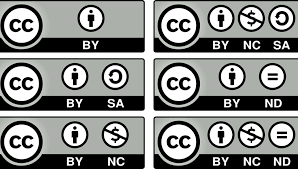

#### Copyleft

Fa ús dels dret d'autor amb l'objectiu de permetre fer servir, distribuir, copiar i alterar l’obra lliurement i exigint que es preservin les mateixes llibertats en les còpies i derivats de l'obra.

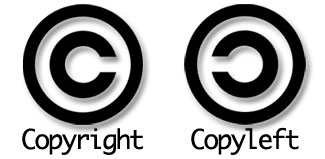

El seu logo és el de copyright invertit.

## Programes d'ordinador

Els programes d’ordinador funcionen diferent de la resta d’obres creatives, ja que són **molt fàcils de copiar**.

- Estan totalment sota drets d’autor en tots els seus components:
  - Codi font
  - Codi Binari
  - Manuals d’usuari
  - Documentació tècnica

### Llicències de software

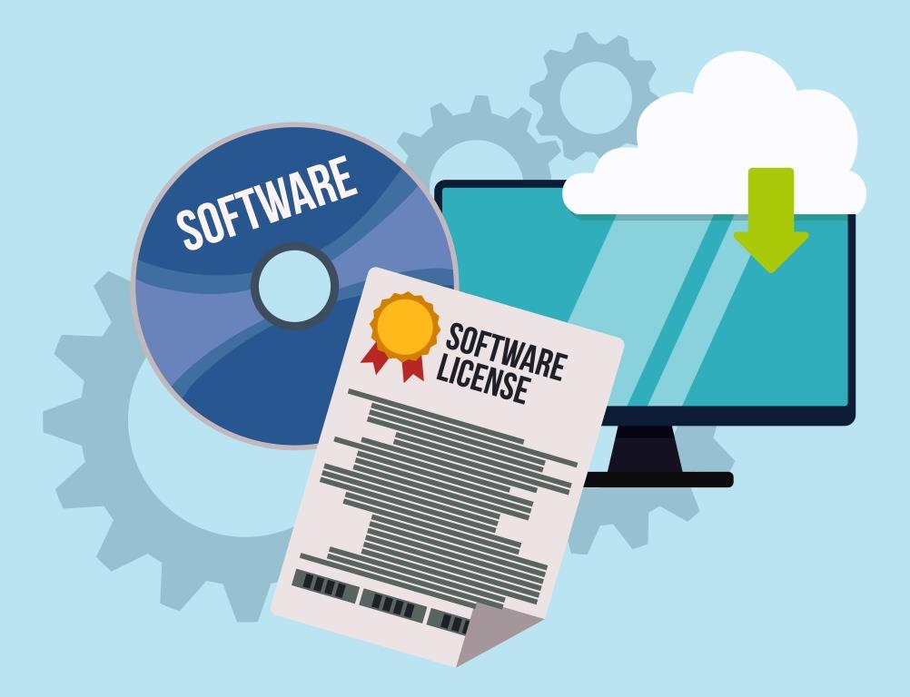

Per poder usar programari cal obtenir el permís per fer-ho. Els creadors de programari fan servir **llicències d’ús**:

- És el contracte que es formalitza en el moment en que s’accepta usar el programari.
- Les llicències solen definir quins **drets** es reben amb el programari. Per exemple:
  - Dret a executar
  - Dret a distribuir
  - Dret a transformar

- Les llicències solen també quant de **temps dura la llicència** i poden ser permanents o bé temporals.

- Les llicències solen **descarregar l’autor de responsabilitat** (Disclaimer).

#### Compromisos de l'usuari

Les llicències defineixen els **compromisos de l’usuari** i com es **pot usar el programari**. Per exemple:

- En quantes màquines es pot instal·lar
- Si està permès modificar el programa (codi font i binari)
- El permís de distribuir el programa o no
- etc.

#### Llicències de sofware més comunes

La diferència més important entre elles té a veure amb les restriccions que porten

[Wikipedia: Taula de llicències comparativa](https://ca.wikipedia.org/wiki/FOSS)

##### Propietàries

Programari d'empreses privades que normalment no dóna accés al codi font, i si es fa, manté totes les restriccions.

- Limiten el dret de distribució, ús, còpia, modificació.
- De fet, no solen permetre modificacions.
- Solen ser de pagament, però no sempre.

Un exemple és el Windows, macOS, etc.

##### Shareware

Programari que es pot provar abans de comprar.

- És un programari que du el permís de redistribució, però que adverteix a tothom que l'ús continuat de la còpia rebuda implica el pagament d'una llicència d'ús.
- Normalment, contenen alguna protecció (desactiva el programa després d'un període de prova, o limita les funcions disponibles). Així "s'anima" a comprar la versió completa.

Per exemple Winrar.

##### Freeware

Programari de lliure ús i gratuït.

- De vegades s'inclou el codi font, però no és necessari.
- Sol incloure una llicència d'ús, que permet que se'l redistribueixi, però amb algunes restriccions com la prohibició de modificar l'aplicació o vendre-la, o l'obligació de retre comptes del seu autor.
- També es pot desautoritzar l'ús amb fins comercials o per una entitat governamental en concret.

#### Freemium

Programari que es pot usar gratuïtament però que té funcionalitats limitades i que permet adquirir més funcionalitats. És molt popular per serveis web, però també en videojocs. Per exemple: League of Legends, Candy Crush, etc.

##### Programari lliure (free software)

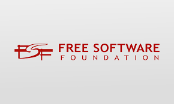

Imposa més obligacions que les Open Source ja que obliga a fer servir **Copyleft**.

- S'hi afegeix una **part ètica i filosòfica** que dona per fet que compartir és un acte natural dels humans. Per tant:
  - Obliga a donar accés al codi font (com open Source).
  - Es pot modificar el programa però **NO es pot canviar la llicència**, ja que llavors no hi hauria **Copyleft**.
  - Per tant obliga a publicar totes les modificacions que es facin.

El programari lliure te el seu principal activista en la figura de **Richard Stallman**.

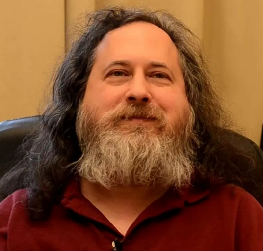

[Richard Matthew Stallman (RMS), creador de GNU y la GPL](https://ca.wikipedia.org/wiki/Richard_Matthew_Stallman)

El programari lliure es basa en les 4 llibertats:

- **Llibertat 0**: **Executar el programa amb qualsevol propòsit** (privat, educatiu, públic, comercial, militar, etc.).
- **Llibertat 1**: **Estudiar i modificar** el programa (cal accés al codi font).
- **Llibertat 2**: **Distribuir el programa** de manera que es pugui ajudar als altres.
- **Llibertat 3**: **Distribuir les versions modificades** pròpies (cal accés al codi font).

[Filosofia del programari lliure (Stallman)](https://www.gnu.org/philosophy/open-source-misses-the-point.es.html)

Llicències lliures més comunes:

- GNU General Public License (GPL)
- Apache License 2.0
- MIT license
- Mozilla Public License (MPL)

[Comparativa Open Source vs Free Software](https://es.wikipedia.org/wiki/Software_libre_y_de_c%C3%B3digo_abierto)

##### Codi obert (open source)

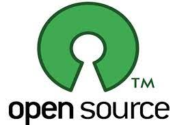

Alguns el consideren una variant del programari lliure. L'Open Source és molt semblant però **NO obliga a mantenir lliure el codi** que es generi a partir d'aquest. O sigui, elimina l'obligació del "copyleft".

Aquest programari obliga a donar **accés al codi font** mentre es mantingui la llicència open source.

- Es pot **fer el que es vulgui** amb el programa.
- També es **pot canviar la llicència** del programari quan s'inclou en un projecte modificat. Per exemple: MAC OS X té parts de FREEBSD dintre el seu codi propietari.
  - **FreeBSD**: És gratuït, Codi obert, es pot modificar lliurement.
  - **OS X**: és de pagament, Llicència comercial, Prohibides les modificacions.

#### Domini públic

Programari que es pot distribuir de manera gratuïta, ja que el programador ha renunciat expressament als drets d'autor, llevat dels drets morals.

## Referències

- [Generalitat de Catalunya. Departament de Cultura: Conceptes Propietat Intel·lectual](https://cultura.gencat.cat/ca/departament/estructura_i_adreces/organismes/rpi/temes/idees_basiques_de_la_propietat_intel_lectual/)
- [Ministerio Cultura: Preguntes freqüents sobre LPI](https://www.cultura.gob.es/cultura/propiedadintelectual/la-propiedad-intelectual/preguntas-mas-frecuentes.html)
- [Llei de propietat intel·lectual](https://portaljuridic.gencat.cat/ca/pjur_ocults/pjur_resultats_fitxa/?documentId=555968&action=fitxa)
- [Creative Commons](https://creativecommons.org/licenses/?lang=es_ES)
- [IMF Blog corporativo: Els 6 tipus de llicència CC](https://www.eipe.es/blog/6-tipos-de-licencias-creative-commons/)
- [Llibre "Copia este libro"](https://www.worcel.com/archivos/6/David-Bravo-Copia-este-libro.pdf)
- [Llicències Open Source](https://opensource.org/licenses)
- [Escollir llicències](https://choosealicense.com/licenses/)

## Documentals

- [DocumaniaTV: Términos y condiciones](https://www.documaniatv.com/ciencia-y-tecnologia/terminos-y-condiciones-de-uso-video_9d65b0d2b.html)
- [YouTube: Copiad, malditos!](https://www.youtube.com/watch?v=YY0i4xJss9c)
- [YouTube: Código Linux](https://www.youtube.com/watch?v=cwptTf-64Uo)
- [YouTube: La historia de Aaron Swartz. El hijo del Internet](https://www.youtube.com/watch?v=mT8FJcIx3HI)
